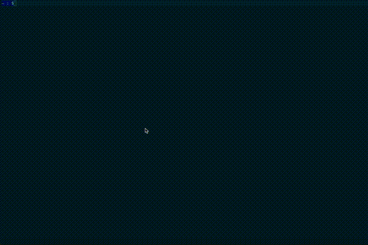

# qiita-tag-feed-reader-cli

[](https://travis-ci.org/shinshin86/qiita-tag-feed-reader-cli)

It is a tool for retrieving posts from [Qiita](https://qiita.com) that are tied to a specific tag in the CLI.




## Usage

```bash
# install
go get github.com/shinshin86/qiita-tag-feed-reader-cli

# Get the post by specifying a random tag
qiita-tag-feed-reader-cli

# Get the post tagged with Go
qiita-tag-feed-reader-cli Go

# Get the post tagged with セキュリティ(Of course, you can also use Japanese.)
qiita-tag-feed-reader-cli セキュリティ
```


## Note

When running without arguments, there are 100 tags that can be selected at random, in order of frequency of use.
However, these tags were obtained in advance using Qiita's API at the time of implementation, So they do not reflect the latest state at runtime.

100 tags are maintained [here](https://github.com/shinshin86/qiita-tag-feed-reader-cli/blob/main/tag/list.go).

